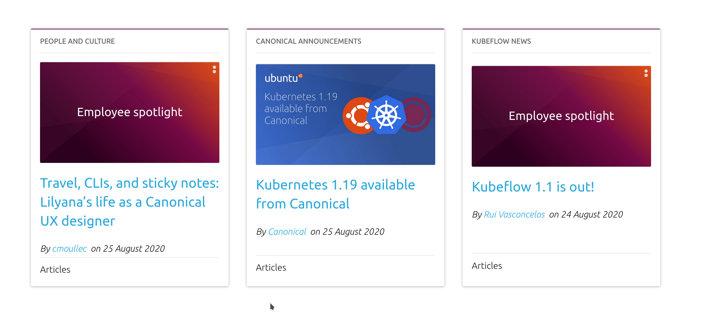

# Demo cards

## Idea

Reproduce the following design of three blog posts in cards:


## Requirements

The requirements are:
* You must use Vanilla framework: vanillaframework.io/docs  
* You must pull the data from the WordPress API: people.canonical.com/~anthonydillon/wp-json/wp/v2/posts.json 

## Local development

```shell
npm run start
```

Open ```http://localhost:8080``` in browser. You should be able to see next content rendered from the provided json data:


